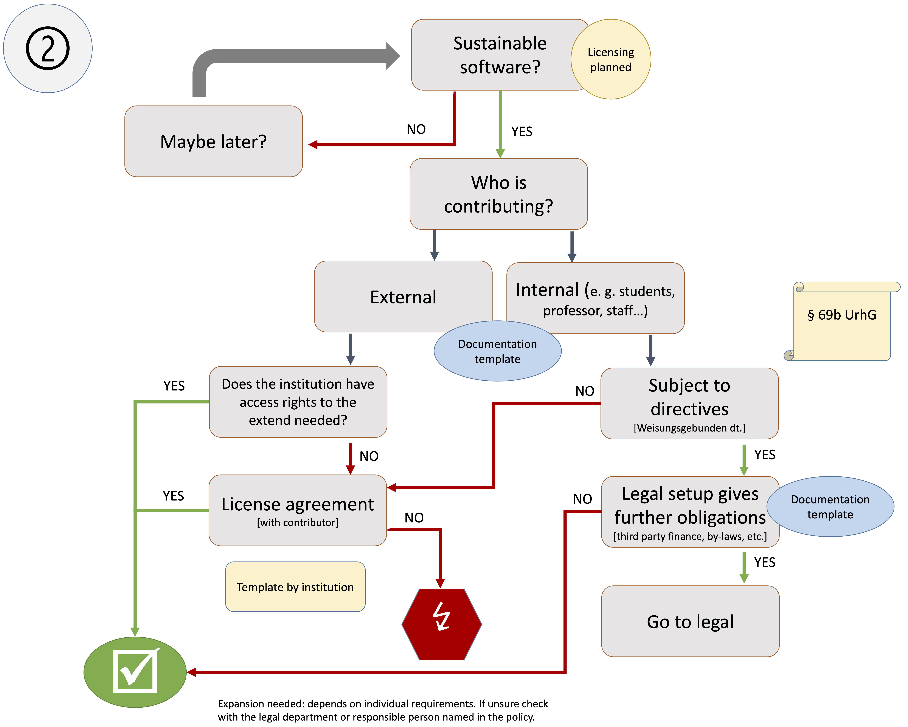
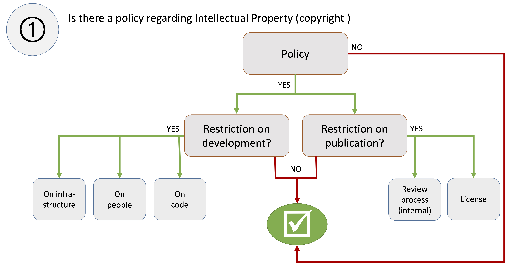
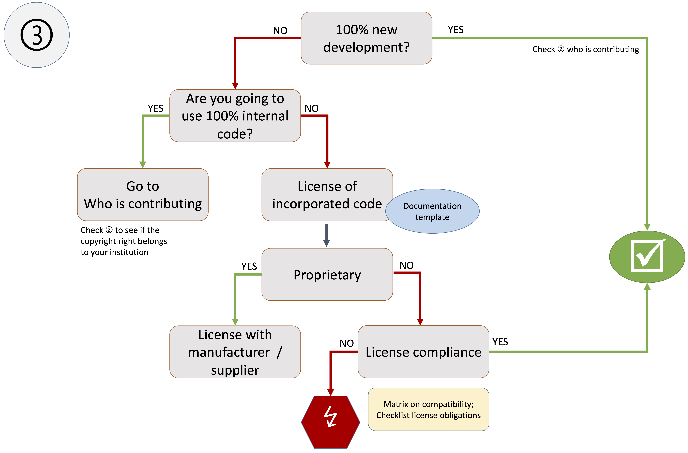
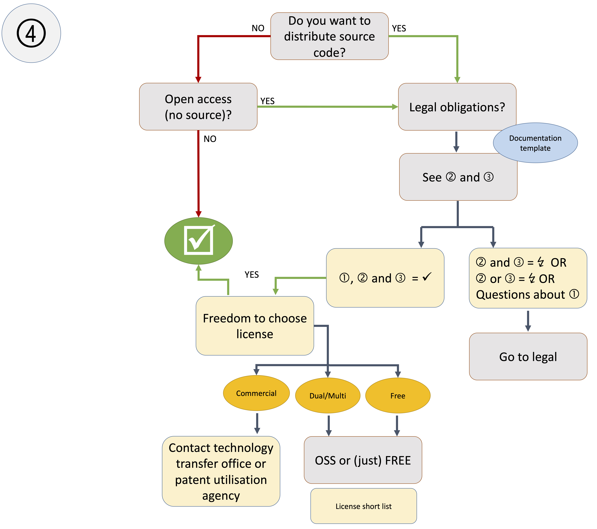

Sustainable Software Development; Academic Software; Software
Infrastructure; Software Training; Software Licensing; Research Software

Background
==========

> Meet Kim, who is currently a post-grad PhD student in researchonomy at
> the University of Arcadia. We will follow Kim’s fictional career in
> order to understand different aspects of research software
> sustainability. Note that in Kim’s world, many of the changes this
> paper calls for have already been implemented.  
> (In our example, Kim is a female person. Of course, research software
> engineers (RSEs) can be any gender.)

Computational analysis of huge data sets, computer-based simulations,
and software technology play a central role for virtually all scientific
breakthroughs of the 21st century. The first “picture” of a black hole
may be the most prominent recent example where astrophysical experiments
and the collection and processing of data had to be complemented with
sophisticated algorithms and software to enable research excellence (The
Event Horizon Telescope Collaboration et al. 2019). Similarly, it is
research software that allows us to get a glimpse of the consequences
our actions today have on the climate of tomorrow. However, an
implication of computer-based research is that findings and data can
only be reproduced, understood, and validated if the software that was
used in the research process is available and
maintained.  
At the same time, sustaining research software, and in particular open
research software, comes with a number of challenges. Commercial
research software often has revenue flows that can facilitate
sustainable software development, maintenance, and documentation as well
as the operation of adequate infrastructure. A large share of researchers (want to or have to) 
researchers base their research on software that was developed in-house
or as community effort. Many of these software stacks can not be
sustained – often because research software was not a first class
deliverable in a research project and hence remained in a prototype
state, or because of missing incentives and resources to maintain the
software after project funding ended. Another fundamental difference to
industrial software development is that most developers of academic
research software (often doctoral students or postdoctoral researchers)
never receive training in sustainable software development. In
particular, as they see themselves usually as the primary user of a
software product, there are virtually no incentives to invest in
sustainability measures such as code documentation or portability. In
combination with most researchers holding only temporary positions, this
results in a highly inefficient system where millions of lines of code
are generated every year that will not be re-used after the termination
of the developer’s position. Part of the problem is the reluctance to
accept research software engineering as an academic profession that
results in a lack of incentives to produce high-quality software:
producing high software quality is resource-demanding, and although the
San Francisco Declaration on Research Assessment (DORA, 2012)
demands for a change in the
academic credit system, many institutions base promotion and
appointments on traditional metrics like the Hirsch index (Hirsch 2005).
It is obvious that an extraordinary amount of idealism is required to
write a sustainable code including documentation and installation
routines, as well as running infrastructure and giving support to others
when the resources can be used more profitably by writing scientific
publications based on fragile prototype software (Bangerth and Heister
2014; Prins et al. 2015).  
Thus, one main factor for the poor sustainability of research software
is the lack of long-term funding for research software engineers
(RSEs, Richardson and Croucher 2018) who take care of the appropriate
architecture, organization, implementation, documentation, and community
interaction for the software, paired with the implementation of measures
towards making the software sustainable during the development
process (Brett et al. 2017).  
In this paper, we describe the state of the practice and current
challenges for research software sustainability, and suggest measures to
be taken towards improvements to solve these challenges. The paper is
the result of a community effort, with work undertaken during two
workshops and subsequent collaborative work across the larger RSE
community in Germany: It has been initiated during a half-day workshop
at the first International Conference for Research Software Engineers in
Germany (deRSE19) in Potsdam, Germany on 5 June 2019 (de-RSE e.V. -
Society for Research Software 2019), and continued during a dedicated
two-day workshop in Berlin, Germany on 7 and 8 November 2019, which was
funded by Deutsche Forschungsgemeinschaft (DFG). Subsequently, the draft
produced during the latter event was opened up for review by the German
RSE community through *de-RSE e.V. - Society for Research Software*.

We mainly focus on the situation of research software and research
software engineers (RSEs) in Germany, where funding bodies increasingly
acknowledge the importance and value of sustainable research software
infrastructures. The German Research Foundation (Deutsche
Forschungsgemeinschaft, DFG), the largest funding body for basic
research in Germany, for example, has opened a call for sustainable
research software development (DFG 2016) at the end of 2016 and a second
call for quality management in research software (DFG 2019b) in June
2019. We note that the first call was oversubscribed by a factor of
10-15, a strong indicator of unmet demand. As another example, the 2019
“Guidelines for Safeguarding Good Research Practice” Code of Conduct of
the DFG (DFG 2019a) now explicitly list software side by side with
research results and data. The FAIR principles for research
data (Wilkinson et al. 2016) provide guidelines for data archiving, but
enabling full reproducibility and traceability of research software
requires additional steps (Hasselbring et al. 2019). In consequence,
there are ongoing discussions whether software should be considered as a
specific kind of research data or as a separate entity (Lamprecht et al.
2019).  
Unfortunately, guidelines and policies for sustainable research software
development in Germany are still lacking and long-term funding
strategies are missing. This all leads to unmet requirements and
unsolved challenges that we want to highlight in this paper by
elaborating on i) why sustainable research software development needs to
be considered a first class citizen in the research landscape; ii) how
to decide which software to sustain; iii) who sustains research
software; iv) how software can be funded sustainably; v) what
infrastructure is needed for sustainable software development; vi) legal
aspects of research software development in academia.

While we specifically focus on the research software landscape in
Germany, we are convinced that many of the analyses, findings, and
recommendations may carry beyond. We want to address RSEs that are all
experiencing similar challenges, newcomers to the field of research
software development, but also political and academic decision makers to
increase awareness of the importance and needs of sustainable software
development. We as a community work hard on overcoming the challenges of
software development in an academic setting, but need support and in
particular reliable funding options and institutional recognition for
the sake of better research.

Why Sustainable Research Software in the First Place?
=====================================================

> After graduation, Kim joins a fixed-term researchonomical research
> project. For her PhD thesis, she wants to crunch some data. Her
> colleague recommends to learn some Boa, which is an all-purpose
> programming language often used in researchonomy. Luckily, the UofA
> runs regular Software Plumbery courses for researchers, including a
> Boa course. Kim takes the course and gains a solid understanding of
> the basics of the Hash shell, version control with Tig, and the basics
> of Boa. She starts writing scripts, which help her a lot with the data
> processing. Unfortunately, Kim’s scripts are quite slow and actually
> break after she installs a newer version of Boa. She visits the weekly
> Code Café organized by her university’s central RSE team. The RSEs not
> only help her update her scripts but also suggest some changes which
> speed up the computation by a factor of 25.  
> During the next meeting with her PhD supervisor, Kim presents her
> collection of scripts. The supervisor encourages Kim to create a Boa
> library from them, as they will be very useful to other
> researchonomists. Thankfully, Kim’s project PI had applied for 3 RSE
> person months in their grant, so the project enlists an RSE from the
> central team. Over the next three months, Kim and the RSE work
> together to build the library, document it, test it, license it under the
> permissive Comanche license, update the TigHub repository to let
> others contribute, introduce automated builds for every code change
> via a continuous integration platform, and make the library citable.
> Finally, they release the first major version of the library, named
> *hal9k* and publish it through the university library’s software
> portal, where they get a DOI (Digital Object Identifier) for the
> version as well as a concept DOI for any future versions of the
> library. Working with the RSE, Kim has gained a good understanding of
> some methods in software engineering, and she’s thrilled because this
> also means she’ll be able to get a job with a local tech company once
> her fixed-term contract has run out.  
> Kim passes her PhD - of which *hal9k* is an important part - with
> flying colours, and soon citations to her library start appearing in
> the researchonomic literature. To Kim’s surprise, she also reads a
> blog post about a citizen science maker project which has used *hal9k*
> to process researchonomic data measured in a neighbourhood of her
> hometown. She is invited to give a talk at the local office of Siren,
> a global tech company, which look to adopt *hal9k*, and pay Kim
> a generous speaker honorarium. So generous in fact, that Kim can pay a student
> assistant for a full year from the money.

Our credibility as researchers in society hinges on the notion of proper
research conduct, also known as “good research practice”. The
digitalization of research has introduced complex digital research
outputs, such as software and data sets. Although first
recommendations (Katerbow and Feulner 2018) and policies (Scheliga et
al. 2019) exist, they are far from being widely adapted. It is still
somewhat unclear how to translate good research practice into research
software practice, for example in terms of validity and reproducibility,
but also pertaining to the responsible use of resources.

While it is obvious that software qualifies as a potentially re-usable
digital artifact, the additional benefit of not just reproducing a given
scenario, but transferring software use to new problems, domains, and/or
applications, justifies developing research software with a long-term
perspective as *sustainable research software*.

In order to support research, a sustainable software must be
correct (Hatton 2007; Chang et al. 2006; Matthews 2007), validatable,
understandable, documented, publicly released, adequately published
(i.e. in persistently identifiable form as software source code (Smith
et al. 2016), and potentially in an additional paper which describes the
software concept, design decisions and development rationale), actively
maintained, and (re-)usable (Merali 2010; Barnes 2010; Tse 2010).

To make software-based research (and with that almost any research)
reproducible, the used software must continue to exist. Furthermore, it must
continue to be usable, understandable, and results return the
same results (or document potential changes and bug fixes) in the
evolving software and hardware environment. Moreover, the software
should support reuse scenarios to avoid duplication of efforts, and
unneeded drain of resources. Therefore, if research software is publicly
funded, it should be freely available under an Open Source Software license.

Currently, creating and using sustainable research software is not 
sufficiently incentivized. To evaluate where to address this
shortcoming, we have identified the following challenges:

-   **Lack of benefit for the individual**: Currently, the primary motivation for
    sustainable research software is the common benefit, rather than the
    individual benefit. It is  clearly beneficial for the
    research community as a whole to direct resources towards sustainable
    research software, as it enables better and more
    research by freeing funds for domain research rather than
    (repetitive) software development. But the developers are often even at a disadvantage
    (e.g., they publish less papers, Bangerth and Heister 2014; Prins et al. 2015), which
    in turn prevents sustainable research software.

-   **Lack of suitable incentive systems**: Contributions to research
    that are not traditional text-based products (i.e., papers or
    monographs) are still not sufficiently awarded, or not awarded at
    all, mainly due to the missing implementation of mandatory software
    citation  (Smith et al. 2016; Hafer and Kirkpatrick 2009; Howison
    and Bullard 2016; Li, Yan, and Feng 2017; Li, Chen, and Yan 2019;
    Park and Wolfram 2019; Pan et al. 2019; Doerr et al. 2019; Druskat
    2019; Katz, Bouquin, et al. 2019).

-   **Lack of awareness**: Research software sustainability
    (cf. (Venters et al. 2014; Goble 2014; Druskat 2016; Katz 2018)) and
    its importance is lacking visibility as well as acceptance, and research software
    engineering in its implementation as sustainable software
    development and software maintenance is not sufficiently supported,
    both in Germany and beyond (Brett et al. 2017; Akhmerov, Cruz,
    Drost, Hof, Knapen, Kuzak, Martinez-Ortiz, et al. 2019; Casties et
    al. 2019).

-   **Lack of expertise**: Knowledge about how to create, maintain, and
    support sustainable research software is emerging (Wilson et al.
    2014, 2017; Stodden and Miguez 2014) but has not yet permeated
    related activities within organizations - specifically teaching,
    mentoring, and consultancy. This lack of expertise can also lead to
    divergence between software design and community uptake, e.g., if
    the software fails to meet the needs of the target group, or is
    insufficiently usable. Research Software Engineers combine
    sustainable software engineering expertise with experience in one or
    more research domains to compensate for lack of expertise on the
    side of domain research.

-   **Heterogeneous research community**: There are significant
    differences with respect to how software is developed, published,
    used, and valued in the different academic disciplines. This also
    makes it hard to train researchers for sustainable software
    development, as beyond basic training in computational research such
    as provided by The Carpentries, advanced courses for Research
    Software Engineering are not widely available (with the notable
    exception of the CodeRefinery project (The CodeRefinery Project
    n.d.)). Targeted curricula must be developed and updated regularly,
    and specialized instructors need to be trained.

-   **Lack of impact measures**: It is unclear how to measure the impact
    of research software with respect to its quality, reusability, and
    benefit for the research community. This exceeds the implementation
    of research software citation (which is work in progress (Smith et
    al. 2016; Li, Lin, and Greenberg 2016; Katz, Bouquin, et al. 2019;
    Druskat 2019)), and pertains to sustainability and policy studies.

-   **Infrastructure issues**: Due to a lack of knowledge about how
    sustainability features impact the application of research software,
    there is not yet enough evidence for whether centralized or
    decentralized facilities should be favored to further research
    software sustainability (Kuchinke et al. 2016; Loewe et al. 2019).
    This in turn leads to a lack of infrastructure as a whole. 

-   **Legal issues**: Many obstacles for research software pertain to
    legal issues, such as applicable licensing (Morin, Urban, and Sliz
    2012), and decisions about license types.

-   **Funding issues**: Despite some individual initiatives (Katz and
    Ramnath 2015; DFG 2016, 2019b; Chan Zuckerberg Initiative n.d.),
    funding for the creation, maintenance, and support of sustainable
    research software is still scarce.

-   **Slow adoption of Research Software Engineers as a profession**:
    Career options for research software work are not fully determined,
    although career paths are emerging in some regions. Initially, the
    RSE initiative in the UK has made progress in this area, and RSE
    groups have been installed in many institutions. In Germany, the US,
    and the Netherlands, this is still work in progress (Brett et al.
    2017; de-RSE e.V. - Society for Research Software n.d.; The US
    Research Software Engineer Association n.d.; The Netherlands
    Research Software Engineer community n.d.). It is also not yet
    determined how to match research software engineering roles in
    public institutions with industry roles (cf. (Rodríguez-Sánchez et
    al. 2017)).

In summary, the necessary but resource-intensive practice of creating,
maintaining, supporting, and funding sustainable research software is
not yet sufficiently incentivized and enabled by research institutions
and funding agencies, nor does it align well with the publish-or-perish
culture that is still prominent in most fields.

Therefore, it is necessary to comprehensively motivate sustainable
research software practice. In the following, we identify stakeholders
of research software (cf. (Katz, Druskat, et al. 2019; Druskat and Katz
2018; Ye et al. 2019)), and explicate their particular motivations for
sustainable research software. Subsequently, we specify challenges
towards satisfying the demands of the individual stakeholders.

Stakeholder motivations for research software sustainability
------------------------------------------------------------

While a wide range of stakeholders share interest in sustainable
software, we argue that their individual motivation can differ quite
significantly:

The **general public** benefits from research which supports the common
good, in other terms: creates a better world, faster. Tax payers have an
interest in economical use of their tax money, to which duplicated or flawed
efforts to create research software – in contrast to software reuse – is
contrary. A subset of this group may be interested in sustainable, i.e.,
re-usable and understandable, software as part of citizen science.

**Domain researchers** benefit from better software to do more, better,
and faster research. Sustainable research software supports this through
validated functionality (e.g., correct algorithms), the potential for
reuse, and general availability. Sustainable software also potentially
simplifies building upon previous research results by re-using the
involved software to produce additional data, or by extending the
software’s functionality. In light of recent updates to definitions of
good research practice (DFG 2019a), sustainable research software also
allows domain researchers to comply with guidelines and best practices.
Additionally, using a software that is sustainable enough to establish
itself as a standard tool in a field signifies inclusion in a research
community. Less directly, researchers may benefit from the existence of
sustainable standard tools as they yield standard formats, which in
themselves facilitate reuse of research data.

**Research Software Engineers (RSEs)** have an intrinsic interest in
sustainable research software. They create better software for research,
which enables more and better research. RSEs have an inherent interest
in developing and working with high quality software, as part of
professional ethics as well as good research practice. RSEs build their
reputation on high quality software and software citation (Smith et al.
2016; Druskat 2019), which will open up new career paths. Finally, for
RSEs, creating sustainable research software is part of an attractive,
intellectually challenging, and satisfying work environment.

**Research leaders** as well as **research performing organizations**
mainly focus on the economic aspects and management of research,
i.e., available funds, people, and time employed to optimize research
output. Both need to make sure that their employees continually improve
their qualification and generate impact to improve their standing in the
various research communities and ensure continued funding. Overseeing
and enabling the creation of sustainable research software advances
their visibility in the field and makes their research endeavors both
more future-proof, and more easily traceable, reproducible, and
verifiable and thus more likely to attract additional resources
(including human resources). **Research performing organizations** can additionally benefit from
sustainable research software if it can be reused in other areas,
creating synergies between different research disciplines. These
synergies typically free resources that can then be used in areas other
than software development and maintenance. Finally, organizations can
gain highly competitive positions in terms of funding and hiring
opportunities, as well as a reputation for being on the cutting edge of
research, through early adoption of research software engineering units,
and the implementation of sustainable research software policy and
practice.

**Geopolitical units** have a strategic interest to be independent of
other geopolitical units to ensure that research can continue seamlessly
regardless of geopolitical developments and ensuing embargoes on
information flow. Reuse of sustainable software additionally frees up
funding for uses other than software development. Well-established,
sustainable software systems can also attract researchers and companies
in the research and technology sector.

**Libraries (also registries, indices)** benefit from sustainable
research software, as it will undergo a formal publishing process and be
properly described in its metadata. Libraries can extend their portfolio
beyond text-based research objects and stake claims as organizations
harnessing the digitalization of research. In turn, they help to
increase visibility and discoverability for research software through
their services and advance the competitiveness of their organization or
geopolitical unit. In addition, libraries also use research software and
would thus benefit directly from a more sustainable research software
landscape. In addition, by using free and open source research software,
libraries could avoid expensive licenses and often insufficiently
adapted commercial software.

**Infrastructure units**, such as supercomputing facilities and
university computing centers, benefit from sustainable software as it
makes their daily work in terms of software installation and user
support easier. Additionally, they can position themselves at the
forefront of research by bundling expertise on the creation and
maintenance of sustainable research software and installing research
software engineering teams.

**Research funding organizations** have inherent interest in – and
directly benefit from – the existence of sustainable research software
as it allows them to direct more resources towards other research topics
and increase return on investment. At the same time, funding
organizations can create incentives for sustainable software by imposing
policies that reflect the necessity of research software sustainability
and creating respective funding opportunities.

**Industry** benefits from sustainable research software, as the process
of creating and maintaining research software produces a highly-skilled
workforce. Depending on the employed licensing model, sustainable
research software can also be adopted by industry partners to reduce
cost in corporate research and development. Helping to sustain research
software may also enable positive outreach for companies across industry
and into society.

**Independent (open source) developers** can get involved in research software, even if they 
are not employed by a research institution. This can help them get in contact with
other developers in the field, and may potentially lead to collaborations or job opportunities in research based on this extended experience.

How to Decide Which Software to Sustain?
========================================

> Kim’s PI is happy, because Kim writes a longer section on *hal9k* for
> the final project report and provides a software management plan
> alongside it, which ticks off a box in the template that the PI had
> previously worried about. The PI does not want to let Kim go and
> instead offers her to be co-PI on a follow-up project to test new
> methods on the data, and integrate them into *hal9k* as well. They are
> positive that such a project proposal has a good chance to be funded,
> as they can show impact of their first project via their university’s
> current research information system (CRIS) and through the number of
> citations of *hal9k* and the publications for which it was used. While
> they write the proposal, the faculty dean approaches the two to tell
> them that based on Kim’s work, they will now negotiate about two new
> members for the central RSE team with the university’s provost for research
> and plan to consider candidates with a background in
> researchonomics.  
> When they get the decision letter from the research funding
> organization, Kim and her co-PI are happy to learn that their new
> project has won the grant. The reviewers specifically point out the
> value of extending Kim’s Boa library to include the proposed new
> methods, as well as the significant reuse potential of *hal9k* for the
> researchonomic community as a direct effect of its well-engineered
> architecture and modularity. Additionally, they stress that it was
> really easy to evaluate the software due to the comprehensive test
> suite, documentation, and example data. In fact, during the first
> month of the new project, three other researchonomic research projects
> approach them to ask whether they can contribute to Kim’s library and
> offer to fund six months of RSE work for this. Kim uses this money to
> also parallelize *hal9k* together with the RSEs and works with her
> university’s computing center to offer it as a standard tool for
> researchonomic supercomputing.

Requirements and Challenges
---------------------------

Sustainability of research software should be considered from the
beginning on for new projects. The criteria listed below, or a subset
such as the “good enough” practices proposed by Wilson et al. (Wilson et
al. 2017), are valuable throughout the development process (including
early phases) for almost all types of research software applications.
“Classical” research funding schemes, should acknowledge the need to
follow best practices during the development of new software and allow
to factor in appropriate resources to design and implement for
sustainability. In this section, we focus on the question which software
to support in dedicated sustainability funding schemes. For such
sustained funding, only software in application class 2 or 3 as defined
by Schlauch et al. (Schlauch, Meinel, and Haupt 2018), i.e. with
significant use beyond personal or institutional purposes, would likely
be considered. The sustained funding of all existing software efforts is
not only impossible, but would risk to overly ramify the community and
eventually become counterproductive to the efficiency of the research
community. Therefore, it is important to agree on a list of transparent
criteria that qualify a software product for sustained funding. We
recognize that defining research software engineering criteria for
software evaluation will also lead to activities aiming at optimizing
scores to achieve these criteria. Hence, the criteria have to be
designed such that all score-pushing effort truly advances the value of
the software. Criteria that can be manipulated without effectively
adding value, i.e., wasting resources, should be excluded. The list of
criteria presented in this chapter could be the basis for a structured
review process that facilitates an unbiased evaluation of software tools
from various fields. Therefore, this list must be general enough to be
applied to research software from various research disciplines while
also respecting differences between fields (e.g. citation rates between
humanities and life sciences). The challenge to do justice to a wide
spectrum is e.g. reflected by suggesting criteria comprising different
levels (Hong 2014). Interestingly, one third of research software
repositories have a lifespan less than one day (median: 15
days, Hasselbring et al. 2019) indicating that many codes are only made
available publicly (as increasingly encouraged or required by
journals (Resnik et al. 2019) and associated with higher
impact (Vandewalle 2012)) but are not maintained. One of the major
challenges in the endeavor to define a selection scheme for sustainable
funding of research software is to organize a fair and transparent
review process. We believe that it is important that the review process
is conducted by experts, or teams of experts, that have a strong
background both on software engineering as well on the domain-specific
aspects, the latter because certain criteria often exist on a spectrum
that is most likely shaped by the specific demands of the respective
research community. While an assessment based purely on quantitative
metrics would allow for seemingly objective comparisons between
programs, the definition of valid and robust quantitative metrics that
can be evaluated with reasonable effort is a major challenge. On the
other hand, a structured qualitative assessment with scores for groups
of criteria can provide a middle ground. It is clear that both preparing
an application for a review against these criteria from the applicant
side as well as the evaluation by the reviewers requires significant
effort. We believe that the added value significantly outweighs the
investment but appropriate resources need to be factored in. Excellence
as reflected in funded projects, publications, and software adoption,
i.e. backing by a community, should be considered during selection.
Nevertheless, we believe a good scheme should strike a balance between
consolidating the field to few well-established software packages on one
side and stimulating innovation and cooperation promoting diversity in
terms of more than one monopolistic package on the other side. Last but
not least, there is an inherent conflict between the long-term goals of
sustainability funding a software and the necessary reevaluation to
monitor the state of the software over time.

Selection Criteria
------------------

Several evaluation schemes for research software have been proposed
before and led to the formulation of first recommendations (Katerbow and
Feulner 2018; Scheliga et al. 2019). Gomez-Diaz & Recio suggested the
CDUR based on Citation, Dissemination (including aspects like license,
web site, contact point), Use, and Research (output) (Gomez-Diaz and
Recio 2019). Lamprecht et al. rephrased the FAIR data
principles (Wilkinson et al. 2016) for research software (Lamprecht et
al. 2019). Hasselbring et al. found that the adoption of FAIR principles
is different between fields with an emphasis on reuse in computer
science as opposed to a reproducibility focus in computational
science (Hasselbring et al. 2019). Fehr et al. collected a set of best
practices for the setup and publication of numerical experiments (Fehr
et al. 2016). Jiménez et al. boiled it down to four best
practices (Jiménez et al. 2017): public source code, community registry,
license, and governance. Hsu et al. (Hsu, Hutchison, and Langseth 2019)
proposed a framework of seven sustainability influences (outputs
modified, code repository used, champion present, workforce stability,
support from other organizations, collaboration/partnership, and
integration with policy). They found that the various outputs are widely
accessible, but not necessarily sustained or maintained. Projects with
most sustainability influences often became institutionalized and met
required needs of the community (Hsu, Hutchison, and Langseth 2019). In
the field of open source software, the CHAOSS (Community Health
Analytics Open Source Software) project has developed metrics to
evaluate sustainability (CHAOSS 2019). One objective of CHAOSS is to
automatically generate project health reports based on software that
evaluates the metrics, with most of the metrics already covered. The UK
Software Sustainability Institute (SSI) suggested both a subjective
tutorial-based and a more objective criteria-based software evaluation
scheme (Jackson, Crouch, and Baxter 2019), the latter being available as
an online form (SSI 2019a). [ROpenSci](https://devguide.ropensci.org/softwarereviewintro.html) provides software reviews
for R developers, which have been very successful in the 
community. 

We drew inspiration from all these works and suggest a set of criteria
to base reviews for sustainable funding on. This set comprises
mandatory, hard criteria that we think have to be fulfilled across
domains (highlighted in bold) and additional desirable, soft criteria
that can be implemented to different degrees depending on the use case
and domain-specific software development requirements. The soft criteria
should be evaluated in a structured way by the reviewers with a specific
response for each section rather than one running text. The fact that
most of these criteria will be considered in any software management
plan (SMP, SSI 2019b) highlights its
importance for sustainable research software.

### Usage and Impact

Requirements qualifying software for sustained funding are (1) its **use
beyond a single research group**, (2) the scientific relevance and
validity of the software documented in **at least one peer-reviewed
scientific publication**. Ideally a paper also describes the scope,
performance and design of the software. (3) The use of the software in
publications is a measure of impact but quantitative assessment brings
about additional challenges (Li, Chen, and Yan 2019). Therefore, other,
potentially domain-specific, impact measures, such as influence on
policy and practice as well as use in other software and products should
be considered as well to evaluate relevance for academia and society.
Considerable attendance at training and networking events can be
considered as a proof of use as well. (4) A **market analysis** needs to
show that the software is important to a user base of relevant size and
either unique or one of the main players in a field with several
existing solutions. Geographical or political aspects can be considered
as well, e.g. to support the maintenance of a European solution. A
convergence process of (parts of) a research community towards a
specific software stack, i.e. documented transition of several research
groups to a common software, would be a strong indicator of impact.
(5) As community benefits are a central goal of sustained software
funding, outreach and **appropriate training material** for new users of
the software are essential.

### Software Quality

As mandatory criteria of software quality that have to be fulfilled, we
consider (6) the **public availability of the source code** in both a 
code repository and an archive (for long term availability), 
developed using
(7) **version control** with meaningful commit messages and linked to an issue tracker (ideally maintained, but at least mirrored on a public platform)
(8) **Documentation** of the software needs to be publicly available
comprising both user documentation (requirements, installation, getting
started, user manual, release notes) and developer documentation (with a development guide and API documentation within the
code, e.g. using Doxygen) (Lee 2018). (9) The **license** under which
the software is distributed must be defined. Publicly funded software
should be published under a Free and Open Source Software license
by default, although exceptions to this might apply (e.g., excluding commercial use).
(10) **Dependencies** on libraries and technologies must be defined.

We acknowledge that some additional criteria have to be evaluated under
consideration of the research domain. These comprise (11) the
availability of examples (comprising input data and reference results),
(12) mechanisms for extensibility (software modularity) as one aspect of
software architecture (Venters et al. 2018) and (13) interoperability
(APIs / common and open data formats for input and output), (14) testing
infrastructure including but not strictly requiring unit tests,
performance tests, regression tests, integration tests, end-to-end tests
(ideally run in an automated fashion in a continuous integration
environment), (15) tagged releases (considering their frequency, and
availability for end users in terms of binary packages for major
operating systems, or availability via package managers or containers),
(16) no (large-scale) re-implementations for functionality for which
good solutions already exist. Many of these aspects require appropriate
infrastructure.

### Maturity

The research software applying for sustained funding must have already
reached a certain level of maturity (typically class 2 or 3 as defined
by Schlauch et al. (Schlauch, Meinel, and Haupt 2018)). A mandatory
requirement is (17) a comprehensive and up-to-date **software management
plan** (SSI 2019b). The software should (18) be maintainable with an
appropriate amount of resources as detailed in a sustainability section
of the software management plan. The software has (19) a well maintained
website with a clearly defined **point of contact** and a communication channel to inform users about news regarding the software such as new releases. Besides an active
user community, sustainable software requires (20) a group of developers
(i.e., definitely **more than 1 developer**) documented, e.g., by
contributions to the code base or participation in documented, public
discussions or issue tracking. Another criterion is (21) whether
potential contributors are invited to participate in a clearly defined
process (e.g., a CONTRIBUTING document). The group of developers should
have defined a governance model for their project and easy ways for users to provide input regarding their needs.

Recommendations
---------------

Given the diversity in the software technology landscape, and the
domain-specific software development cultures (Johanson and Hasselbring
2018), some of the above-mentioned criteria have to be evaluated against
domain-specific requirements. Therefore, we highly recommend to base the
selection process on a combination of i) a software quality-based review
and ii) a domain-specific scientific review. In particular, the former
should be ideally performed by a central institution (e.g. at funding
bodies or other independent agencies such as a software sustainability
institute). Only criteria for which improvement truly advances the value
of the software should be considered in evaluation schemes, i.e., no
criteria that can be gamed. After rejecting software not fulfilling the
mandatory criteria in a first stage of the review process, the second
stage of the selection process should be realized as a transparent
procedure ideally allowing the reviewers to interact with the principal
investigators of the software (e.g. remote meetings, forum-like
discussions) and put the software quality and development efforts into
the domain-specific context. The outcome of this second stage should be
a structured review assessing each criterion explicitly and a rating for
each of the dimensions *Usage and Impact, Software Quality, and
Maturity*. For sustained software funding it is important to audit the
performance, relevance, impact, progress, and level of sustainability of
funded software after reasonable time frames. Such a reevaluation should
revisit the criteria under consideration of evolving software technology
and scientific standards, without requiring a completely new proposal
being submitted. We envision funding periods of 5 years to provide
sufficient security for funded software projects, while allowing for
adaptation of the portfolio of funded software to novel research
directions and community needs. Failure to meet the reevaluation
criteria should lead to the decision to phase-out sustainable funding.
The phase-out process may come with a 1-year funding program with clear
goals regarding the archiving and preservation of the software,
documentation, and all existing resources in a consolidation plan.

Who Sustains Research Software?
===============================

> Kim wants to broaden her research portfolio within researchonomics and
> applies for postdoctoral positions at other institutions. Her library
> *hal9k* is growing in popularity within researchonomics, and she wants
> to continue working on it. As her university has adopted an open
> science policy, *hal9k* is free software under an open source license,
> and Kim is free to continue her work on the library even after moving
> away from UofA.  
> Due to her involvement in the creation of *hal9k* as well as her
> previous success in attracting funding, Kim has the choice between
> multiple, attractive positions and decides to temporarily move to the
> researchonomics group at Eden University (EdU). She has already
> extended *hal9k* in multiple directions in the past and plans to
> continue this work at EdU. Her group leader at EdU would like to
> continue funding her, but due to a law called the Fixed-term Research
> Contract Bill, EdU is not allowed to extend her contract, and neither
> third-party funding for her own position nor a permanent position are
> available. After having developed a now widely-used research tool,
> several publications in software and paper form, as well as having
> attracted funding, Kim finds herself looking for a job again.

Research relies on software and software relies on the people developing
and maintaining it. Sustainable research requires sustainable software,
and this in turn requires continuity for those who develop and maintain
it.

Requirements
------------

Possibly the most important demand is the need for an increase in
**recognition and awareness** of research software as a first class
citizen in research (Akhmerov, Cruz, Drost, Hof, Knapen, Kuzak,
Martinez-Ortiz, et al. 2019; Chue Hong 2019; Scheliga et al. 2019). For
sustainability of research software, long-term commitments of the
respective software leads are crucial, but no **professional RSE
profiles** currently exist. In consequence, it is essential to create
career paths for research software engineers (RSEs) that are attractive
and include permanency. While creating permanent positions in the German
academic system below the faculty level is an actively discussed topic
overall (Vereinigung der Kanzlerinnen und Kanzler der Universitäten
Deutschlands 2019), we specifically focus on the needs originating from the
development and maintenance of research software here.

As already mentioned, research software development not only requires
domain expertise, but also software development **education, skills, and
competencies**. Currently, most of the domain researchers developing and
maintaining domain-specific software technology never received
professional training on software development (Wilson et al. 2014;
Philippe et al. 2019). To enhance the productivity and sustainability of
computer-based research, it is essential to integrate software
development training into the education of domain researchers.

Currently, a significant portion of the existing research software is
developed by individuals or in small groups, primarily to serve their
own requirements. This situation is unsatisfying in terms of
collaboration and inefficient in terms of several groups spending
resources on generating similar or even the same functionality. To
enable and promote synergies, it is important to allocate resources for
research software development and to build **communities**, as described
in (Katz et al. 2019).

Challenges
----------

We are currently facing a **lack of awareness** for the importance of
research software as discussed above. Moreover, there is
**little recognition** for the efforts put into software development and
maintenance. In consequence, software development in academic settings
is mostly considered as a means to an end and sustainability is often
not considered in project planning and grant proposals and contributes
little to progressing research careers (Science Guide 2019; “San
Francisco Declaration on Research Assessment” 2012). The main challenge
here is the continued use of metrics that primarily leverage
traditionally published articles and article citation numbers.

In academia, developers of research software are typically domain
researchers, and in particular if new areas are explored, the software
development process itself has research character. Obviously, developing
research software requires not only domain knowledge but also software
development skills, and the researchers leading the software development
process are often domain experts with substantial software development
experience, making them extremely valuable members of the research community. However, the current academic system in Germany does not
provide a defined **RSE role**. Limited-term positions are, at least
currently within the main German academic system, often effectively the
end of their career path, sometimes even a dead end. The challenge here
is the lack of available permanent positions within the non-professorial
academic faculty (“Mittelbau”) in Germany, as well as the already
mentioned lack of recognition for efforts concerning research software
for faculty appointments within domain sciences.

In order to develop sustainable software, researchers need to have the
**skills and expertise** to build software that is easy to maintain and
extend (Carver, Hong, and Thiruvathukal 2016). However, most of the
researchers are self-taught developers (Wilson et al. 2014; Philippe et
al. 2019). Ideally, these skills have to be built into the domain
science curricula, which could generally be done in two different ways
(or a combination of them). One obvious solution attempt are additional
courses that focus on these topics. The main challenge here is to decide
which other topic(s) to possibly drop due to the limited volume of any
given curriculum. A different approach is to incorporate
software-related topics into existing domain science courses. While this
would provide the benefit of show-casing the usage of specific software
skills directly within the domain science, the challenge here is the
amount of work necessary to change existing lecture material, let alone
the need of the lecturers to acquire those skills themselves in the
first place.

As long as the necessary software skills within domain sciences are not
yet wide-spread, building a network from those that have acquired
relevant skills is difficult. **Community** efforts, that concentrate on
questions regarding research software, can help to fill this gap.
However, since research software is such an interdisciplinary topic, it
is hard to get recognition and find funding within any specific
discipline. As a result, existing communities often have to rely heavily
on volunteers. This is challenging, because despite benefits to domain
science, volunteers hardly receive recognition for their work “back
home”, i.e., within their domain, underlining again the importance of
our first demand.

Recommendations
---------------

Increasing **recognition and awareness** is a challenge that calls for
both immediate action and perseverance. Nevertheless, some measures will
likely show positive effects comparatively soon:

Similarly to plans for research data management, funding agencies should
request that applicants include considerations about how software
developed in a project can be sustained beyond the end of the funded
project. A follow up on these plans during and after the project
lifetime, i.e., a dedicated software management plan, is crucial.

Another recommendation is aimed at decision makers concerning
recruitment for academic positions: broaden the definition of research
impact beyond traditional scientific publications to also include other
impactful results. Not all researchers thinking of themselves as RSEs
pursue a faculty position as their main career goal. However, permanent
academic non-faculty positions are rare within the German
academic system, also due to the lack of a defined **RSE role**. We
recommend research institutions to leverage the benefit of dedicated
RSEs by establishing attractive long-term career options in the academic
environment. The long-term solution in order to gain sufficient software
development **skills** should be education that is included early in the
career path, ideally already at the Bachelor level. For the time being
however, efforts involving workshops and seminars that provide easy
access to hands-on training on software-related questions should be
promoted and supported as much as possible.

It is important to provide an environment where **communities** can form
and flourish by allocating resources for research software development
and for building communities around it (Katz et al. 2019; Iaffaldano et
al. 2019; Jiménez et al. 2017). The identification with a community of
like-minded people and personal action (Allen et al. 2017) can lead to a
permanent establishment of sustainable research software as a valuable
research output. Thus, research institutions as well as funding agencies
should not only be open-minded regarding existing volunteer
organizations, but should actively promote the creation of such groups.

How can Research Software be Sustainably Funded?
================================================

> *Hal9k* has grown into a widely used software in researchonomics, and
> Kim is proactively asked to apply for - and is subsequently awarded -
> a permanent RSE position at the institute for researchonomy at UofA,
> based on her work on the library. She works closely with the central
> RSE team, but mostly due to bureaucracy and the high demand for her
> library, Kim does not have enough time to maintain and further develop
> *hal9k* alone anymore. Together with the dean she develops a course
> for the researchonomics curriculum which teaches data processing with
> *hal9k*. As a lesson from her own career, she starts the course with
> sessions on the Hash shell, version control with Tig, Boa, and two
> whole sessions on basics of sustainable software development. This is
> very fruitful, and due to the implementation of a new research
> software funding scheme at UofA, Kim is able to hire one of the course
> students, who has shown great research software engineering skills
> straight into a long-term position at her institute, where they focus
> on the maintenance and development of *hal9k*, work with the computing
> center to support *hal9k*-based supercomputing on a new, dedicated
> FGPA cluster, develop training materials for external users, and
> organize the yearly *hal9k* users and developers conference. Kim gets
> to travel the world to visit researchonomics groups who are using
> *hal9k*.

Requirements
------------

Sustainable funding for research software boils down to funding the four
main pillars enabling sustainable software development: i) Personnel
with expertise in research software development; ii) Infrastructure for
developing, testing, validating, and benchmarking research software, and
distributed versioning systems for collaborative software development;
iii) Training in software design and sustainable software development;
and iv) Community management and events for creating synergies between research groups
and software efforts.

Challenges
----------

Short-term engagement of (young) researchers raises the question of how
to maintain a constant level of expertise within a developer team and
preventing knowledge drain concerning domain knowledge and software
engineering skills. Conversely, the permanent engagement of qualified
personnel requires to offer career perspectives, especially due to the
fact that academia competes with industry for the same people. A
challenge specific to Germany is posed by the shortage of permanent
positions and by the restrictions for temporary positions due to the
German *Wissenschaftszeitvertragsgesetz* (Bundesministerium der Justiz
und für Verbraucherschutz 2007).

Sustainable software development requires hardware technology to
develop, test, validate, and benchmark features in a continuous
integration cycle. The challenge in this context is the persistent
evolution of the hardware landscape. Hence, for creating an environment
promoting sustainable software development, it is important to provide
access to a wide hardware portfolio and to support a development cycle
based on continuous integration.

Expertise in sustainable research software development is a scarce
resource, and training is heavily needed as one way of building up more
expertise. However, while integrating interdisciplinary software
engineering courses into the education curriculum can build up basic
skills, some expertise is domain-specific and requires
inter-institutional training activities. Furthermore, there exist no
financial incentives for creating software-specific documentation and
tutorials nor to provide other forms of support.

While the creation of research software communities is one of the major
assets in sustaining research software technology, promoting this
process requires the installation of new funding instruments.
Traditionally, research grants are limited to rather short time frames
and support personnel, material, hardware, and to a limited degree also
travel and research visits. Creating a research software community
however requires funding for community and training events as well as
“virtual hardware” such as webspace, versioning systems, task-managing
systems, and compute cycles. These demands can hardly be met without
third-party funding (Kuchinke et al. 2016; Chang, Mills, and Newhouse
2007; Aartsen et al. 2018; Gabella, Durinx, and Appel 2018).

Recommendation: Creation of Adequate Funding Schemes
----------------------------------------------------

Funding is a crucial factor for sustaining research software. Currently
available sources and instruments are not adequately shaped for the
challenges and solutions outlined above. We recommend actions on the
individual, organizational, and national level.

Existing project-focused funding instruments on the local, national, and
international level need to be complemented with funding instruments
specifically designed for research software development and sustained
research software maintenance to make research software a first class
citizen in the research landscape. For example, software projects
enhancing research and fulfilling the sustainability criteria detailed
above may be entitled for sustained funding as long as they
live up to the standards and remain a central component of the research
landscape.

Computing centers and supercomputing facilities for research need to
receive earmarked resources for the support of sustainable software
development. This funding is necessary to provide continuous integration
services, a hardware portfolio for development, testing and benchmarking
software, as well as personnel for training domain researchers in
software design and the proper usage of the services.

The creation and maintenance of training material for general research
software engineering education and the software-specific documentation
and tutorial creation needs to be reflected in funding opportunities.
This can either happen by dedicating modules of research or software
grants to providing support and the generation of training material, or
by opening funding schemes focusing on interdisciplinary software
development education. The latter may include research that looks at
research software development as a process to analyze which measures,
interactions, and team compositions make research software successful.
Additionally, funding instruments fostering the formation of research
software communities have to be established.

Which Infrastructure is Needed to Sustain Research Software?
============================================================

> As the *hal9k* community grows, so does the need for infrastructure.
> Kim and her team collaborate with the National Research Software
> Engineering Consortium to set up *hal9k* on the Consortium’s
> distributed TigHub instance, and organize world-wide access to it via
> the NRSEC-AAI federation. Going forward, the Consortium’s Research Software Hub -
> a registry and [Software Heritage](softwareHeritage.org) archive-based long-term repository
> for research software on a national level - ingests *hal9k* releases
> with complete metadata: citation metadata, the *hal9k* provenance
> graph and computational environment information, ORCIDs, etc. and
> provides its own DOIs for versions under a concept DOI. The community
> reviews all code and documentation changes that are contributed to
> *hal9k* via the central TigHub, and the Hub’s CI system Alfred builds,
> tests, and pushes new releases automatically to the registered
> supercomputing clusters. Especially the community efforts become
> better and more streamlined by the day, as research software
> development training is now offered as part of most curricula, and
> skilled RSEs are now much easier to find and hire by research
> institutions.

Project Management Tools
------------------------

Research software is developed by individual researchers, in small teams
within a single institution, or in larger teams distributed across
multiple institutions. In particular if software development is
distributed across institutions, there exists an urgent need for
frameworks and tools enabling collaborative code development, software
feature planning, and software management. As research software
development typically includes bleeding-edge research and development
that the researchers do not want to disclose for a certain time to
preserve intellectual property, distributed research software
development also needs a global Authentication and Authorization
Infrastructure (AAI). We recommend the development and/or deployment of
tools for distributed software development and software management as
central research infrastructure. An important aspect in this context is
the cataloging of research software to reduce the duplication of
development efforts. This can efficiently be realized by promoting the
registration of all research software efforts with an ID
and developing a tool that allows to explore the research software
landscape.

Quality Assurance
-----------------

Sustaining research software requires a centralized facility enabling
its promotion, and ensuring high quality. This includes defining quality
metrics, guidelines, and best practices tailored towards the academic
system as well as software testing and validation infrastructures in
terms of continuous integration services. The concept of
project-external software reviews should be included in the service
curriculum, which requires either establishing a workforce of skilled
and experienced software development experts, or drawing on expertise of
external experts such as the Software Sustainability Institute (SSI)
(see above for details).

Scalable Computing Resources
----------------------------

Software used for computer-based research often has to solve compute-
and data-intensive problems. Thus, software used in scientific computing
typically needs to be parallelized and ready for large-scale computing
facilities. In consequence, the performance optimization and scalability
of research software itself can become an important research topic.
Thus, quick and easy access to scalable computing resources for
development, testing, and benchmarking research software is important
for high productivity of RSEs. Furthermore, researchers often need a
customized compute environment in terms of operating system, compilers,
and libraries that can efficiently be encapsulated in containers.

Fulfilling these demands is challenging as i) the shared usage of high
performance computing systems leads to non-deterministic runtimes;
ii) waiting times for large-scale jobs in today’s batch systems are
usually long; iii) diversity of platforms that might be relevant for
testing is high; iv) the extremely high energy consumption of the
respective systems make both frequent testing and testing of
reproducibility on outdated systems infeasible.

Tackling these challenges requires new access and deployment policies in
computing centers allowing, e.g., exclusive access for large-scale, but
short, test runs. Such more flexible concepts could also comprise fixed
regular periods that are reserved for performance and scalability tests.
The issue of availability of the respective system to ensure
reproducibility of data shortly after publication can only be solved (to
a limited extent) by software solutions for performance modeling /
simulation. We see the responsibility to provide such solutions at the
European (HPC Europe), national (such as the German Gauss Center for
Supercomputing), and federal scale (such as KONWIHR). Besides investment
in people providing and developing the mentioned software solutions and
access concepts, also funding for hardware is required.

Developer Training, Motivation, and Knowledge Exchange
------------------------------------------------------

As elaborated, training in sustainable software development is key to
achieve sustainability in research software technology. At the same
time, it is not clear how such training should be facilitated and
institutionalized. Furthermore, for deriving software quality standards,
evaluating the quality of software, and providing a code review service,
central resources are necessary that individuals and groups in the
research software landscape can draw from.

We consider Software Carpentry and similar efforts like the creation of
the Data Science Academy in the Helmholtz Association of German Research
Centers helpful solutions to exchange and distribute knowledge. Local
chapters of RSE groups and (inter-)national conferences will further
foster networking and community building. We strongly recommend the
creation of a national Software Sustainability Institute (involving
funded positions to establish web platforms and training material)
similar to the [UK Software Sustainability
Institute](https://www.software.ac.uk/), which serves as a national
contact for all aspects related to research software. The UK SSI also
publishes best practice guidelines for the [Software/Systems Development
Life Cycle (SDLC)](https://www.software.ac.uk/resources).
Furthermore we recommend establishing masters degrees in research software engineering.

Research Software Discovery and Publication
-------------------------------------------

Proper software publication and possibilities for the community to find
existing software solutions for a given problem are a prerequisite to
optimally exploit synergies and avoid redundant development. However, we
observe that today, many funding proposals lack a thorough
state-of-the-art report of software that could possibly be reused. This
is most often caused by insufficient information retrieval strategies,
lack of knowledge about relevant repositories, and an abundance of
locations where software is collaboratively developed and stored (Struck
2018). Discovery requires publication in a globally accessible location
with appropriate metadata, e.g., Citation File Format (CFF) (Druskat et
al. 2019) and CodeMeta (The CodeMeta Project 2019). Comprehensive
metadata (e.g. contributors, contact, keywords, linked publications,
etc.) and publishing platforms have to enable persistent citing, which
in turn benefits research evaluation. Selection and curation of software
(probably by a data/software librarian) for publication and discovery
are certainly challenging.

We consider GitLab or GitHub as collaborative working environments and
repositories like [Zenodo.org](Zenodo.org) appropriate publication
platforms, because the latter mint DOIs, allow versioning and are
publicly funded for long-term access. GitHub, Figshare, and Mendeley
Data are examples of commercial enterprises with business cases in the
background, which exploit taxpayer-funded research results. Besides the
aforementioned metadata standards, it is advisable to document source
code, e.g., using MarkDown (with Doxygen tooling). Metadata and
citations play a role in beneficial tools like PIDgraph,
[DataCite.org](DataCite.org), [CrossRef.org](CrossRef.org), which
utilize Persistent Identifiers (PIDs) like DOIs. Another solution to
discovery are (mostly) disciplinary software indices like swMATH (swMATH
2019) or the Astronomy Source Code Library (ASCL.net 2019) or language 
focused systems like CRAN (https://cran.r-project.org) for R. These
started as national endeavors and became platforms of global importance.
For Germany, we assume that the Nationale Forschungsdateninfrastruktur
(NFDI) will put effort into creating discovery platforms that ease
information retrieval. At the same time, all stakeholders should be
aware of and counteract potential institutional “fear” losing “their”
data, software, and intellectual property.

Especially in interdisciplinary environments, it would be helpful to
have access to a meta software repository index, similar to what
[re3data.org](re3data.org) does for research data repositories. We
recommend the creation of such a meta index covering important
(disciplinary) software indexes in order to ease discovery of relevant
software locations. This requires significant investment in long-term
infrastructure. When publishing research software it is recommended to
make use of integration schemes like GitHub with Zenodo or local GitLab
instances with publication platforms. Such indices and publication
outlets may benefit national federated research indexing & archiving
systems, similar to the hierarchy of library catalogs (Mönnich 2001).

Archiving
---------

Software preservation aims to extend the lifetime of software that is no
longer actively maintained. There are different approaches, which vary
in the effort required and the likelihood of success. Software archiving
is one important aspect of software preservation: the process of storing
a copy of a software so that it may be referred to in the future. The
publication of a certain software version for reference in research
articles requires simple ways to archive research software on a
long-term basis. At present, the corresponding infrastructure is lacking
or is not globally accessible. Furthermore, its integration with
collaborative software development environments such as GitLab or GitHub
and with publication repositories is needed to facilitate archiving of
referenced software versions based on sustainable frameworks (e.g.
[invenio-software.org](invenio-software.org) for GitHub to Zenodo
integration).

A big challenge for software archiving is the need to preserve the
runtime environment and all dependencies of the software. This may
improve reproducibility, especially when running the software in its
original state. If research data are needed to reproduce results, they
should also be archived with the software or the publication.
Specialized and unique hardware - like high performance computing
resources - can be part of the runtime environment, which may not be
accessible in the future. To overcome this, an emulation of hardware may
be a (challenging) solution. Emulation involves the encapsulation and
distribution of the complete hardware and software stacks, including the
operating system and driver interdependencies. This can result in
intellectual property issues when offered as a service.

There are both local and global approaches to software conservation. One
solution to keep the software in an executable state by preserving its
context and runtime environment is to use containers such as docker.
However, to archive the docker containers, additional metadata should be
added and stored with the software in an archive container format that
allows exchange between repositories and exit strategies, such as the
BagIt container format (Kunze et al. 2018). Application or platform
conservation is also achieved by conservational efforts where
unmaintainable (virtual) machines are sandboxed to keep the platform in
a secure but running state. Another threat is losing project
repositories on global platforms like Github or BitBucket. Here, global
platforms like [softwareHeritage.org](softwareHeritage.org) harvest
those repositories and prevent loss by long-term archiving.

Legal Aspects
=============

> More and more industrial partners enter the *hal9k* community, and
> they bring their lawyers. Together with UofA’s research software task
> force, the RSE team, the researchonomy institute, the corporate
> lawyers, and community representatives, Kim decides to create a
> foundation to govern *hal9k* and its environment: the Fullest Possible
> Use Foundation for Open Researchonomy, funded by the Ministry of
> Research and Education and a consortium of corporate partners. As a
> first step, they re-license *hal9k* under the OSI approved MIT
> license.

A common situation in research software creation is that the developer
has no knowledge or awareness of legal aspects and therefore did not
consider them early enough. Thus, we think the main legal demands for
research software development are raising awareness and empowering all
levels of responsible persons in academia (from researcher and RSEs over
PIs to research performing organizations and research funding
organizations) in legal aspects. This will hopefully lead to a general
legal certainty before, during, and after the research software
development process and thus enable better options for collaborations
between universities, non-commercial research institutions, and other
national or international partners. Legal aspects always have to be
considered regarding the relevant jurisdiction. Though similar issues
arise in all jurisdiction, the following will focus on the European and
German legal framework.

Challenges and Clarifications
-----------------------------

### Clarification of Rights

Software development is a creative activity. The main relevant law
governing legal aspects is therefore the copyright law. It regulates the
rights and obligations of the parties involved. Chapter 8 of the German
Act on Copyright and Related Rights (UrhG) contains specific provisions
applicable to computer programs and is based on the EU computer programs
directive. Copyright law protecting the creator of software in similar
ways exist in nearly all legal systems. It is important for the
identification of rights that software, in the sense of (German) law,
includes not only the source code but also the design
materials (Bundesministerium der Justiz und für Verbraucherschutz
2014a). The challenge in the use, distribution, and commercialization of
software is to determine the chain of rights and to identify all right
holders. The owner of the copyright is not necessarily the owner of the
right of use. For Germany, the Copyright Act regulates the rights for
employment relationships (Bundesministerium der Justiz und für
Verbraucherschutz 2014b). In such cases, the right of use is
automatically transferred to the employer. This means that in most cases
of employed software developers and research staff, the institution
holds the rights of use for the software work. This is not automatically
the case for students, freelancers, and individual external cooperation
partners. Employment and service contracts with contributors could
contain regulations regarding the transfer of rights of use. For
researchers who conduct free research not subject to directives, in
Germany the constitution guarantees freedom of research so that the
rights of use for their work remains initially with the natural person.
In addition to the rights of the people directly involved, other rights
of third parties may also be relevant. Existing source code (e.g., other
free/libre open source software, FLOSS), external libraries, and
contributions from institutional cooperation partners are published and
provided under certain licenses and their conditions must be observed.
The nature of research careers often brings additional complications in
the chain of rights. It happens that researchers take their software
with them when they change institutions and develop it further during
their career. Here, the former employer may be entitled to some rights
of use. In third-party funded projects, in particular with industry, but
also with funding from research funding organizations, rules regarding
rights of use are often defined. Last but not least, the software can
also be affected by other (intellectual) property rights such as patents
or trademarks. Software itself is usually not patentable but it may
implement a technical invention covered by patents. When using or
distributing such software, an additional matching patent license may be
necessary. Licenses exist (for example: GNU GPL v3) which automatically
grant related patent licenses while using the software license. That
should be considered when exploitation of the patent is planned.

### Liability

Issues of warranty and liability for faulty software must be taken into
account. We consider the possibilities of contractual limitation of
liability in licenses. Full exclusions of liability are generally
invalid in the German law. Limitations of liability usually depend on
the form of distribution: The limitation options are larger if the
rights of use are granted free of charge, e.g. provision “as is” as
defined in the BSD 3-clause license.

Ideas for Solutions
-------------------

In order to meet the legal challenges mentioned, it is absolutely
necessary for the software developer (team) to document the rights chain
comprehensively during the software development (see supplementary
material). Contributions of individual persons must be traceable and
their (labor law) status must be named. At best, contracts with rules on
the transfer of rights of use should be concluded before work begins.
Declarations of assignment of rights can be made for existing works.
License conditions for external contributions must be evaluated with
regard to further rights of use and possible sublicensing. Contracts and
funding conditions must be conscientiously documented and analysed with
regard to rules on rights of use. In case that different parts of the
software are based on different conditions and rights of third parties,
individual modules of the new software could be published under
different licenses and merged accordingly.

A national research software sustainability consortium could be
established. The consortium supports local research software task forces
and thereby respective researchers and research teams in the licensing
of research software and related legal issues. For this purpose, a legal
help desk will be set up, to which all members of their respective
research performing organization can apply. If researchers want to
publish the research software under an open source license, the
organization could bundle the necessary rights beforehand. This is
particularly useful when teams of researchers, often international,
write software. In addition, the consortium may serve as a one-stop-shop
for the licensing of research software.

Recommendations
---------------

We see it as an essential part of the sustainability of research to
enable the free distribution of research software. There are a variety
of open source software (OSS) licensing models (ranging from permissive
to copyleft; for further information, see (ifrOSS 2019) (tl;drLegal
2019) (Morin, Urban, and Sliz 2012)). The use of a FSF- or OSI-approved
license for example would enable a truly free model and also reduce
legal issues. We recommend that research funding organizations like DFG
discuss if they expect publishing all funded software under these
licenses, following the paradigm of “public money, public code” (fsfe
2017).

<figure>
<figcaption><strong>Decision tree for contributors</strong>. This tree helps to find out whether the academic institution where the software development is located is the owner of the intellectual property (copyright).</figcaption>
</figure>

Also for legal aspects, we believe it is important that all (German)
research performing organizations install a **research software task
force**, especially since the new DFG Code of Conduct (DFG 2019a) is
released. Besides organization and bundling of technical and
infrastructural support for local RSEs and researchers (see previous
sections), this group should organize a local **legal help desk**,
organize **educational offers** e.g. for the legal topics presented, and
(if not implemented yet) develop the **software policy** of the research
performing organization. As an example, with the help of on-boarding
processes performed by the research software task force, RSEs should be
able to keep the clearance of rights as simple as possible right from
the start. One possibility how local legal help desks could structure
their work is shown in the decision tree in
Fig. <a href="#fig:tree1Article" data-reference-type="ref" data-reference="fig:tree1Article">1</a>.
A more complete suggestion for decision trees for both legal help desks
and interested RSE can be found in the supplementary material. We suggest
that the local task forces build a network with the other research
performing organizations for exchange of ideas but also for generating a
bottom-up strategy to organize RSE standards for Germany and beyond and
possibly be the origin of the aforementioned consortium.

Conclusions
===========

We find that the research software ecosystem is notoriously lacking
resources despite its strategic importance. If funding and support does
not improve, the success story of science based on academic research
software may be at stake. We strongly advise the implementation of
funding schemes for sustainably supporting the development and
maintenance of research software, for creating incentives to produce
high quality community software, and for enabling career paths as
research software engineer (RSE). We recommend the installation of
infrastructure that enables sustainable software development including
platforms for collaboration, continuous integration, testing, and
long-term preservation. We suggest the establishment of a nationwide
institution similar to the Software Sustainability Institute (SSI) to
provide project consulting and code review services as well as
sustainable software development training. We think that sustainable
software development should become an integral component of the
universities’ teaching curriculum. Finally, we urge the research funding
bodies to reflect the licensing models for academic software
development, and to decide whether the “public money, public code”
paradigm justifies the requirement that all publicly-funded software has
to be publicly available under an open source license.

Declarations
============

Consent for Publication
-----------------------

Not applicable

Competing Interests
-------------------

The authors declare that they have no competing interests.

Funding
-------

The authors thank the DFG for funding a meeting (*Rundgespräch*, grants
LO 2093/3-1 and SE 1758/6-1) during which the initial draft of this
paper has been created. We are particularly grateful for the support
from Dr. Matthias Katerbow (DFG).

This work was additionally supported by Research Software Sustainability
grants funded by the DFG (DFG 2018): Aggarwal: 390886566; PI: Zesch.
Appel: 391099391; PI: Balmann. Bach & Loewe & Seemann: 391128822; PIs:
Loewe / Scholze / Seemann / Selzer / Streit / Upmeier. Bader: 391134334;
PIs: Bader / Gabriel / Frank. Brusch: 391070520; PI: Brusch. Druskat:
391160252; PI: Gast / Lüdeling. Ebert: 391137747; PI: Marschall.
Flemisch & Herrmann: 391049448; PIs: Boehringer / Flemisch / Hermann.
Hohmann: 391054082; PI: Hepp. Goth: 390966303; PI: Assaad. Grad &
Weeber: 391126171; PI: Holm. Kutra: 391125810; PI: Kreshuk. Mehl &
Uekermann: 391150578; PIs: Bungartz / Mehl / Uekermann. Peters-Kottig:
391087700; PIs: Gleixner / Peters-Kottig / Shinano / Sperber. Raters:
39099699; PI: Herwartz. Reina: 391302154; PIs: Ertl / Reina. Muth &
Renard: 391179955; PIs Renard / Fuchs. Ropinski: 391107954; PI:
Ropinski.

Author’s Contributions
----------------------

We are a group of software-providing researchers, RSEs, and
infrastructural as well as legal supporters. Initially, a group of
representatives of funded projects of the first DFG sustainability
call (DFG 2018) met during the first German RSE conference
(deRSE) (de-RSE e.V. - Society for Research Software 2019) in June 2019
in a grass-roots workshop on sustainable research software addressing
the software-based research community. During this workshop, we realized
that a lot of valuable experience and good ideas are present in the
group, and we decided to start working on this paper together with other
interested practitioners. We followed the generous invitation of the DFG
for the above mentioned two day meeting in the Robert Koch Institute in
Berlin in November 2019 to sharpen the focus of this paper.  
The individual contributions of authors to this work are detailed below,
following the [CASRAI CRediT](https://casrai.org/credit/) (Contributor
Roles Taxonomy):

-   **Conceptualization:** Anzt, Bach, Druskat, Loewe, Löffler, Renard,
    Seemann, Struck

-   **Funding acquisition:** Loewe, Seemann

-   **Investigation:** Bach, Druskat, Loewe, Löffler, Renard, Seemann

-   **Project administration:** Loewe, Seemann

-   **Visualization:** Unger, Friedl

-   **Writing original draft:** Achhammer, Aggarwal, Anzt, Appel, Bach,
    Bader, Brusch, Druskat, Ebert, Flemisch, Friedl, Funk, Grad, Goth,
    Herrmann, Hohmann, Kutra, Linxweiler, Loewe, Löffler, Muth,
    Peters-Kottig, Rack, Raters, Rave, Reina, Renard, Ropinksi,
    Schaarschmidt, Seemann, Struck, Thiele, Uekermann, Unger, Weeber

-   **Writing review & editing:** Anzt, Appel, Bach, Bader, Brusch,
    Busse, Chourdakis, Druskat, Friedl, Funk, Herrmann, Janosch, Loewe, Löffler, Rack, Reina,
    Renard, Seemann, Seibold, Struck, Thiele, Uekermann

Supplementary Material
=====================

### Decision Trees for Legal Topics

The decision trees presented here shall help legal help desks and
developers to identify risks regarding the mandate of the software. In a
perfect world, one would address the legal aspects at the start of a
project. It is crucial to know about these to create sustainable
software. We strongly recommend to write a documentation of the answers
and outcomes. Please keep in mind that only restrictions from copyright
law are addressed. In some project you might also have to consider
patents, trademarks etc.

Before you can publish, use, and/or license a software, you have to
check:

-   The policy of the institution
    (Fig. <a href="#fig:tree0" data-reference-type="ref" data-reference="fig:tree0">2</a>)

-   The rights restriction imposed by the persons who “create” the
    software
    (Fig. <a href="#fig:tree1" data-reference-type="ref" data-reference="fig:tree1">3</a>)

-   The rights restriction imposed by the environment
    (Fig. <a href="#fig:tree1" data-reference-type="ref" data-reference="fig:tree1">3</a>)

-   If third-party code is incorporated
    (Fig. <a href="#fig:tree2" data-reference-type="ref" data-reference="fig:tree2">4</a>)

We also built a tree for the scenario that you have to check for already
existing software
(Fig. <a href="#fig:tree3" data-reference-type="ref" data-reference="fig:tree3">5</a>).

<figure>
<figcaption><strong>Policy</strong>. This tree recommends to check closely any policies implemented in the software developers organization.</figcaption>
</figure>

<figure>
<figcaption><strong>Contributors</strong>. This tree helps to find out whether the academic institution where the software development is located is the owner of the intellectual property (copyright).</figcaption>
</figure>

<figure>
<figcaption><strong>Code history</strong>. The code history tree points out tasks for projects that incorporate existing code.</figcaption>
</figure>

<figure>
<figcaption><strong>Licensing</strong>. Depending on the distribution model, open access (OA) or open source software can be selected.</figcaption>
</figure>

If the outcome is a red lightning, we believe there is no other solution
than to rewrite parts of the code or the whole code. If the outcome is a
green checkmark, we believe you have the right you need to proceed. The
other outcomes are self-explaining (e.g. go to legal).

References
==========

Aartsen, Wendy, Paul Peeters, Scott Wagers, and Bryn Williams-Jones.
2018. “Getting Digital Assets from PublicPrivate Partnership Research
Projects Through “the Valley of Death, ” and Making Them Sustainable.”
*Frontiers in Medicine* 5 (March): 65.
<https://doi.org/10.3389/fmed.2018.00065>.

Akhmerov, Anton, Maria Cruz, Niels Drost, Cees Hof, Tomas Knapen,
Mateusz Kuzak, Carlos Martinez-Ortiz, and Yasemin Turkyilmaz-van der
Velden. 2019. “Making Research Software a First-Class Citizen in
Research.” <https://doi.org/10.5281/zenodo.2647436>.

Akhmerov, Anton, Maria Cruz, Niels Drost, Cees Hof, Tomas Knapen,
Mateusz Kuzak, Carlos Martinez-Ortiz, Yasemin Turkyilmaz-van der Velden,
and Ben van Werkhoven. 2019. “Raising the Profile of Research Software:
Recommendations for Funding Agencies and Research Institutions.” NWO
(The Netherlands Organisation for Scientific Research).

Allen, Alice, Cecilia Aragon, Christoph Becker, Jeffrey Carver, Andrei
Chis, Benoit Combemale, Mike Croucher, et al. 2017. “Engineering
Academic Software (Dagstuhl Perspectives Workshop 16252).” Edited by
Alice Allen et al. *Dagstuhl Manifestos* 6 (1): 1–20.
<https://doi.org/10.4230/DagMan.6.1.1>.

ASCL.net. 2019. “Astrophysics Source Code Library.”
[ascl.net](ascl.net).

Bangerth, Wolfgang, and Timo Heister. 2014. “Quo Vadis, Scientific
Software?” *SIAM News* 47 (1): 8.

Barnes, Nick. 2010. “Publish Your Computer Code: It Is Good Enough.”
*Nature* 467 (7317): 753. <https://doi.org/10.1038/467753a>.

Brett, Alys, Michael Croucher, Robert Haines, Simon Hettrick, James
Hetherington, Mark Stillwell, and Claire Wyatt. 2017. “Research Software
Engineers: State of the Nation Report 2017.”
<https://doi.org/10.5281/zenodo.495360>.

Bundesministerium der Justiz und für Verbraucherschutz. 2017. “Gesetz
über Befristete Arbeitsverträge in Der Wissenschaft.”
[www.gesetze-im-internet.de/wisszeitvg](www.gesetze-im-internet.de/wisszeitvg).

———. 2014a. “§69a Subsection (1) Urhg.”
[www.gesetze-im-internet.de/urhg/\_\_69a.html](www.gesetze-im-internet.de/urhg/__69a.html).

———. 2014b. “§69b Urhg.”
[www.gesetze-im-internet.de/urhg/\_\_69b.html](www.gesetze-im-internet.de/urhg/__69b.html).

Carver, Jeffrey C, Neil P Chue Hong, and George K Thiruvathukal. 2016.
*Software Engineering for Science*. CRC Press.

Casties, Robert, Alexander Czmiel, Julia Damerow, Max Ionov, Albert
Meroño Peñuela, Steve Ranford, Catherine Smith, and Malte Vogl. 2019.
“DH Research Software Engineers - for We Are Many.” *DHTech*.
<http://web.archive.org/web/20190829122818/https://dh-tech.github.io/dhrse-whitepaper/>.

Chang, Geoffrey, Christopher B. Roth, Christopher L. Reyes, Owen
Pornillos, Yen-Ju Chen, and Andy P. Chen. 2006. “Retraction.” *Science*
314 (5807): 1875–5. <https://doi.org/10.1126/science.314.5807.1875b>.

Chang, Victor, Hugo Mills, and Steven Newhouse. 2007. “From Open Source
to Long-Term Sustainability: Review of Business Models and Case
Studies.” In *Proceedings of the Uk E-Science All Hands Meeting 2007*.
University of Edinburgh/University of Glasgow (acting through the NeSC).
[eprints.leedsbeckett.ac.uk/649](eprints.leedsbeckett.ac.uk/649).

Chan Zuckerberg Initiative. n.d. “Essential Open Source Software for
Science.” Accessed December 13, 2019.
[web.archive.org/web/20191213112602/chanzuckerberg.com/rfa/essential-open-source-software-for-science](web.archive.org/web/20191213112602/chanzuckerberg.com/rfa/essential-open-source-software-for-science).

CHAOSS. 2019. “CHAOSS Metrics.”
[chaoss.community/metrics](chaoss.community/metrics).

Chue Hong, Neil. 2019. “Making Software A First-Class Citizen.”
<https://doi.org/10.6084/m9.figshare.9862835.v1>.

de-RSE e.V. - Society for Research Software. 2019. “Konferenz Für
Forschungssoftwareentwicklerinnen in Deutschland.”
[web.archive.org/web/20191213123440/de-rse.org/en/conf2019](web.archive.org/web/20191213123440/de-rse.org/en/conf2019).

———. n.d. “De-RSE.Org - Research Software Engineers (RSEs) - the People
Behind Research Software.” Accessed December 13, 2019.
[web.archive.org/web/20190325110948/www.de-rse.org/en](web.archive.org/web/20190325110948/www.de-rse.org/en).

DFG. 2016. “Nachhaltigkeit von Forschungssoftware.”
[www.dfg.de/foerderung/info\_wissenschaft/2016/info\_wissenschaft\_16\_71](www.dfg.de/foerderung/info_wissenschaft/2016/info_wissenschaft_16_71).

———. 2018. “Geförderte Projekte Ausschreibung Nachhaltigkeit
Forschungssoftware.”
[gepris.dfg.de/gepris/suche/projekt/research\_software](gepris.dfg.de/gepris/suche/projekt/research_software).

———. 2019a. “Guidelines for Safeguarding Good Research Practice.”
[www.dfg.de/en/research\_funding/principles\_dfg\_funding/good\_scientific\_practice](www.dfg.de/en/research_funding/principles_dfg_funding/good_scientific_practice).

———. 2019b. “Qualitätssicherung von Forschungssoftware Durch Ihre
Nachhaltige Nutzbarmachung.”
[www.dfg.de/foerderung/info\_wissenschaft/info\_wissenschaft\_19\_44](www.dfg.de/foerderung/info_wissenschaft/info_wissenschaft_19_44).

Doerr, Allison, Nicole Rusk, Nina Vogt, Rita Strack, Lei Tang, Singh
Arunima, and Vivien Marx. 2019. “Giving Software Its Due.” *Nature
Methods* 16 (3): 207–7. <https://doi.org/10.1038/s41592-019-0350-x>.

Druskat, Stephan. 2016. “A Proposal for the Measurement and
Documentation of Research Software Sustainability in Interactive
Metadata Repositories.” In *Proceedings of the Fourth Workshop on
Sustainable Software for Science: Practice and Experiences (WSSSPE4)*,
edited by Gabrielle Allen, Jeffrey Carver, Sou-Cheng T. Choi, Tom Crick,
Michael R. Crusoe, Sandra Gesing, Robert Haines, et al. Vol. 1686.
Manchester, UK: CEUR-WS.
<http://ceur-ws.org/Vol-1686/WSSSPE4_paper_20.pdf>.

———. 2019. “Software and Dependencies in Research Citation Graphs.”
*Computing in Science & Engineering*.
<https://doi.org/10.1109/MCSE.2019.2952840>.

Druskat, Stephan, and Daniel S. Katz. 2018. “Mapping the Research
Software Sustainability Space.” In *2018 IEEE 14th International
Conference on E-Science (E-Science)*, 25–30.
<https://doi.org/10.1109/eScience.2018.00014>.

Druskat, Stephan, Jurriaan H. Spaaks, Neil Chue Hong, Robert Haines, and
James Baker. 2019. “Citation File Format (CFF) - Specifications.”
<https://doi.org/10.5281/zenodo.3515946>.

fsfe. 2017. “Public Money Public Code.”
[publiccode.eu](publiccode.eu).

Fehr, Jörg, and Jan Heiland, Christian Himpe, and Jens Saak. 2016. “Best
Practices for Replicability, Reproducibility and Reusability of
Computer-Based Experiments Exemplified by Model Reduction Software.”
*AIMS Mathematics* 1 (3): 261–81.
<https://doi.org/10.3934/math.2016.3.261>.

Gabella, Chiara, Christine Durinx, and Ron Appel. 2018. “Funding
Knowledgebases: Towards a Sustainable Funding Model for the UniProt Use
Case.” *F1000Research* 6 (March): 2051.
<https://doi.org/10.12688/f1000research.12989.2>.

Goble, C. 2014. “Better Software, Better Research.” *IEEE Internet
Computing* 18 (5): 4–8. <https://doi.org/10.1109/MIC.2014.88>.

Gomez-Diaz, Teresa, and Tomas Recio. 2019. “On the Evaluation of
Research Software: The CDUR Procedure.” *F1000Research* 8 (August):
1353. <https://doi.org/10.12688/f1000research.19994.1>.

Hafer, Lou, and Arthur E. Kirkpatrick. 2009. “Assessing Open Source
Software as a Scholarly Contribution.” *Commun. ACM* 52 (12): 126–29.
<https://doi.org/10.1145/1610252.1610285>.

Hasselbring, Wilhelm, Leslie Carr, Simon Hettrick, Heather Packer, and
Thanassis Tiropanis. 2019. “FAIR and Open Computer Science Research
Software.” *arXiv* 1908.05986. <https://arxiv.org/abs/1908.05986>.

Hatton, Les. 2007. “The Chimera of Software Quality.” *Computer* 40 (8):
104–3. <https://doi.org/10.1109/MC.2007.292>.

Hirsch, J. E. 2005. “An Index to Quantify an Individuals Scientific
Research Output.” *PNAS* 102 (46): 16569–72.
<https://doi.org/10.1073/pnas.0507655102>.

Hong, Neil Chue. 2014. “Minimal information for reusable scientific
software.” In *2nd Workshop on Sustainable Software for Science:
Practice and Experiences (Wssspe2)*.
<https://doi.org/10.6084/m9.figshare.1112528.v1>.

Howison, James, and Julia Bullard. 2016. “Software in the Scientific
Literature: Problems with Seeing, Finding, and Using Software Mentioned
in the Biology Literature.” *Journal of the Association for Information
Science and Technology* 67 (9): 2137–55.
<https://doi.org/10.1002/asi.23538>.

Hsu, Leslie, Vivian B. Hutchison, and Madison L. Langseth. 2019.
“Measuring Sustainability of Seed-Funded Earth Science Informatics
Projects.” Edited by Rashid Mehmood. *PLOS ONE* 14 (10): e0222807.
<https://doi.org/10.1371/journal.pone.0222807>.

Iaffaldano, Giuseppe, Igor Steinmacher, Fabio Calefato, Marco Gerosa,
and Filippo Lanubile. 2019. “Why Do Developers Take Breaks from
Contributing to Oss Projects? A Preliminary Analysis.”

ifrOSS. 2019. “Lizenz Center.”
[ifross.github.io/ifrOSS/Lizenzcenter](ifross.github.io/ifrOSS/Lizenzcenter).

Jackson, Mike, Steve Crouch, and Rob Baxter. 2019. “Software Evaluation
Guide.”
[www.software.ac.uk/resources/guides-everything/software-evaluation-guide](www.software.ac.uk/resources/guides-everything/software-evaluation-guide).

Jiménez, Rafael C., Mateusz Kuzak, Monther Alhamdoosh, Michelle Barker,
Bérénice Batut, Mikael Borg, Salvador Capella-Gutierrez, et al. 2017.
“Four Simple Recommendations to Encourage Best Practices in Research
Software.” *F1000Research* 6 (June): 876.
<https://doi.org/10.12688/f1000research.11407.1>.

Johanson, Arne, and Wilhelm Hasselbring. 2018. “Software Engineering for
Computational Science: Past, Present, Future.” *Computing in Science &
Engineering* 20 (2): 90–109.

Katerbow, Matthias, and Georg Feulner. 2018. “Recommendations on the
Development, Use and Provision of Research Software.”
<https://doi.org/10.5281/zenodo.1172988>.

Katz, Daniel S. 2018. “Fundamentals of Software Sustainability.” *Daniel
S. Katz’s Blog*.
[web.archive.org/web/20191213110119/danielskatzblog.wordpress.com/2018/09/26/fundamentals-of-software-sustainability](web.archive.org/web/20191213110119/danielskatzblog.wordpress.com/2018/09/26/fundamentals-of-software-sustainability).

Katz, Daniel S., Daina Bouquin, Neil P. Chue Hong, Jessica Hausman,
Catherine Jones, Daniel Chivvis, Tim Clark, et al. 2019. “Software
Citation Implementation Challenges.” *arXiv:1905.08674 \[Cs\]*.
[arxiv.org/abs/1905.08674](arxiv.org/abs/1905.08674).

Katz, Daniel S., Stephan Druskat, Robert Haines, Caroline Jay, and
Alexander Struck. 2019. “The State of Sustainable Research Software:
Learning from the Workshop on Sustainable Software for Science: Practice
and Experiences (WSSSPE5.1).” *Journal of Open Research Software* 7 (1):
11. <https://doi.org/10.5334/jors.242>.

Katz, Daniel S., and Rajiv Ramnath. 2015. “Looking at Software
Sustainability and Productivity Challenges from NSF.” *arXiv:1508.03348
\[Cs\]*. <http://arxiv.org/abs/1508.03348>.

Katz, D. S., L. C. McInnes, D. E. Bernholdt, A. C. Mayes, N. P. C. Hong,
J. Duckles, S. Gesing, et al. 2019. “Community Organizations: Changing
the Culture in Which Research Software Is Developed and Sustained.”
*Computing in Science & Engineering* 21 (2): 8–24.
<https://doi.org/10.1109/MCSE.2018.2883051>.

Kuchinke, Wolfgang, Christian Ohmann, Holger Stenzhorn, Alberto
Anguista, Stelios Sfakianakis, Norbert Graf, and Jacques Demotes. 2016.
“Ensuring Sustainability of Software Tools and Services by Cooperation
with a Research Infrastructure.” *Personalized Medicine* 13 (1): 43–55.
<https://doi.org/10.2217/pme.15.43>.

Kunze, John, John Scancella, Chris Adams, and Justin Littman. 2018. “The
BagIt File Packaging Format (V1. 0).” RFC 8493. RFC Editor; Internet
Requests for Comments; RFC Editor. <https://doi.org/10.17487/RFC8493>.

Lamprecht, Anna-Lena, Leyla Garcia, Mateusz Kuzak, Carlos Martinez,
Ricardo Arcila, Eva Martin Del Pico, Victoria Dominguez Del Angel, et
al. 2019. “Towards Fair Principles for Research Software.” *Data
Science*. <https://doi.org/10.3233/DS-190026>.

Lee, Benjamin D. 2018. “Ten Simple Rules for Documenting Scientific
Software.” Edited by Scott Markel. *PLOS Computational Biology* 14 (12):
e1006561. <https://doi.org/10.1371/journal.pcbi.1006561>.

Li, Kai, Pei-Ying Chen, and Erjia Yan. 2019. “Challenges of Measuring
Software Impact Through Citations: An Examination of the Lme4 R
Package.” *Journal of Informetrics* 13 (1): 449–61.
<https://doi.org/10.1016/j.joi.2019.02.007>.

Li, Kai, Xia Lin, and Jane Greenberg. 2016. “Software Citation, Reuse
and Metadata Considerations: An Exploratory Study Examining LAMMPS.”
*Proceedings of the Association for Information Science and Technology*
53 (1): 1–10. <https://doi.org/10.1002/pra2.2016.14505301072>.

Li, Kai, Erjia Yan, and Yuanyuan Feng. 2017. “How Is R Cited in Research
Outputs? Structure, Impacts, and Citation Standard.” *Journal of
Informetrics* 11 (4): 989–1002.
<https://doi.org/10.1016/j.joi.2017.08.003>.

Loewe, Axel, Gunnar Seemann, Eike Moritz Wülfers, Yung-Lin Huang, Jorge
Sánchez, Felix Bach, Robert Ulrich, and Michael Selzer. 2019. “SuLMaSS -
Sustainable Lifecycle Management for Scientific Software.” In
*E-Science-Tage 2019: Data to Knowledge*.
<https://doi.org/10.11588/HEIDOK.00026843>.

Matthews, Brian W. 2007. “Five Retracted Structure Reports: Inverted or
Incorrect?” *Protein Science* 16 (6): 1013–6.
<https://doi.org/10.1110/ps.072888607>.

Merali, Zeeya. 2010. “Computational Science: ...Error.” *Nature* 467
(7317): 775–77. <https://doi.org/10.1038/467775a>.

Morin, Andrew, Jennifer Urban, and Piotr Sliz. 2012. “A Quick Guide to
Software Licensing for the Scientist- Programmer.” *PLoS Computational
Biology* 8 (7): e1002598.
<https://doi.org/10.1371/journal.pcbi.1002598>.

Mönnich, Michael W. 2001. “KVK - a Meta Catalog of Libraries.” *LIBER
Quarterly* 11 (2): 121–27.

“ORCID.” 2019. [orcid.org/](orcid.org/).

Pan, Xuelian, Erjia Yan, Ming Cui, and Weina Hua. 2019. “How Important
Is Software to Library and Information Science Research? A Content
Analysis of Full-Text Publications.” *Journal of Informetrics* 13 (1):
397–406. <https://doi.org/10.1016/j.joi.2019.02.002>.

Park, Hyoungjoo, and Dietmar Wolfram. 2019. “Research Software Citation
in the Data Citation Index: Current Practices and Implications for
Research Software Sharing and Reuse.” *Journal of Informetrics* 13 (2):
574–82. <https://doi.org/10.1016/j.joi.2019.03.005>.

Philippe, Olivier, Martin Hammitzsch, Stephan Janosch, Anelda van der
Walt, Ben van Werkhoven, Simon Hettrick, Daniel S. Katz, et al. 2019.
“softwaresaved/international-survey: Public release for 2018 results.”
<https://doi.org/10.5281/zenodo.2585783>.

Prins, Pjotr, Joep de Ligt, Artem Tarasov, Ritsert C Jansen, Edwin
Cuppen, and Philip E Bourne. 2015. “Toward Effective Software Solutions
for Big Biology.” *Nature Biotechnology* 33 (7): 686–87.
<https://doi.org/10.1038/nbt.3240>.

Resnik, D. B., M. Morales, R. Landrum, M. Shi, J. Minnier, N. A.
Vasilevsky, and R. E. Champieux. 2019. “Effect of Impact Factor and
Discipline on Journal Data Sharing Policies.” *Accountability in
Research* 26 (3): 139–56.
<https://doi.org/10.1080/08989621.2019.1591277>.

Richardson, Chris, and Mike Croucher. 2018. “Research Software Engineer:
A New Career Track?”
[sinews.siam.org/Details-Page/research-software-engineer-a-new-career-track](sinews.siam.org/Details-Page/research-software-engineer-a-new-career-track).

Rodríguez-Sánchez, Francisco, Ben Marwick, Ed Lazowska, and Jake
VanderPlas. 2017. “Academia’s Failure to Retain Data Scientists.”
*Science* 355 (6323): 357–58. <https://doi.org/10.1126/science.aam6116>.

“San Francisco Declaration on Research Assessment.” 2012.
[sfdora.org/read](sfdora.org/read).

Scheliga, Kaja, Heinz Pampel, Uwe Konrad, Bernadette Fritzsch, Tobias
Schlauch, Marco Nolden, Wolfgang Zu Castell, et al. 2019. “Dealing with
Research Software: Recommendations for Best Practices.” Helmholtz Open
Science Coordination Office. <https://doi.org/10.2312/OS.HELMHOLTZ.003>.

Schlauch, Tobias, Michael Meinel, and Carina Haupt. 2018. “DLR Software
Engineering Guidelines.” Deutsches Zentrum für Luft- und Raumfahrt
(DLR). <https://doi.org/10.5281/ZENODO.1344612>.

Science Guide. 2019. “Room for Everyone’s Talent.”
[www.scienceguide.nl/wp-content/uploads/2019/11/283.002-Erkennen-en-Waarderen-Position-Paper\_EN\_web.pdf](www.scienceguide.nl/wp-content/uploads/2019/11/283.002-Erkennen-en-Waarderen-Position-Paper_EN_web.pdf).

Smith, Arfon M., Daniel S. Katz, Kyle E. Niemeyer, and FORCE11 Software
Citation Working Group. 2016. “Software Citation Principles.” *PeerJ
Computer Science* 2: e86. <https://doi.org/10.7717/peerj-cs.86>.

SSI. 2019a. “Online Sustainability Evaluation.”
[www.software.ac.uk/resources/online-sustainability-evaluation](www.software.ac.uk/resources/online-sustainability-evaluation).

———. 2019b. “Writing and Using a Software Management Plan.”
[www.software.ac.uk/resources/guides/software-management-plans](www.software.ac.uk/resources/guides/software-management-plans).

Stodden, Victoria, and Sheila Miguez. 2014. “Best Practices for
Computational Science: Software Infrastructure and Environments for
Reproducible and Extensible Research.” *Journal of Open Research
Software* 2 (1): e21. <https://doi.org/10.5334/jors.ay>.

Struck, Alexander. 2018. “Research Software Discovery: An Overview.” In
*2018 IEEE 14th International Conference on E-Science*. IEEE.
<https://doi.org/10.1109/escience.2018.00016>.

swMATH. 2019. “An Information Service for Mathematical Software.”
[swmath.org](swmath.org).

The CodeMeta Project. 2019. “The Codemeta Project.”
[codemeta.github.io](codemeta.github.io).

The CodeRefinery Project. n.d. “CodeRefinery - Lessons.” Accessed
January 20, 2020.
<http://web.archive.org/web/20180531130106/http://coderefinery.org/lessons/>.

The Event Horizon Telescope Collaboration, Kazunori Akiyama, Antxon
Alberdi, Walter Alef, Keiichi Asada, Rebecca Azulay, Anne-Kathrin
Baczko, et al. 2019. “First M87 Event Horizon Telescope Results. IV.
Imaging the Central Supermassive Black Hole.” *The Astrophysical
Journal* 875 (1): L4. <https://doi.org/10.3847/2041-8213/ab0e85>.

The Netherlands Research Software Engineer community. n.d. “The
Netherlands Research Software Engineer Community.” *NL-RSE*. Accessed
December 13, 2019.
[web.archive.org/web/20191213123459/nl-rse.org](web.archive.org/web/20191213123459/nl-rse.org).

The US Research Software Engineer Association. n.d. “US-RSE.” Accessed
December 13, 2019.
[web.archive.org/web/20191213123453/us-rse.org](web.archive.org/web/20191213123453/us-rse.org).

tl;drLegal. 2019. “Software Licenses in Plain English.”
[tldrlegal.com](tldrlegal.com).

Tse, Herman. 2010. “Computer Code: More Credit Needed.” *Nature* 468
(7320): 37. <https://doi.org/10.1038/468037a>.

Vandewalle, P. 2012. “Code Sharing Is Associated with Research Impact in
Image Processing.” *Computing in Science & Engineering* 14 (4): 42–47.
<https://doi.org/10.1109/MCSE.2012.63>.

Venters, Colin C., Rafael Capilla, Stefanie Betz, Birgit Penzenstadler,
Tom Crick, Steve Crouch, Elisa Yumi Nakagawa, Christoph Becker, and
Carlos Carrillo. 2018. “Software Sustainability: Research and Practice
from a Software Architecture Viewpoint.” *Journal of Systems and
Software* 138 (April): 174–88.
<https://doi.org/10.1016/j.jss.2017.12.026>.

Venters, Colin C, Caroline Jay, L. M. S. Lau, M. K. Griffiths, V.
Holmes, R. R. Ward, J. Austin, C. E. Dibsdale, and J. Xu. 2014.
“Software Sustainability: The Modern Tower of Babel.” In *Proceedings of
the Third International Workshop on Requirements Engineering for
Sustainable Systems Co-Located with 22nd International Conference on
Requirements Engineering (RE 2014)*, 1216:7–12. Karlskrona, Sweden:
CEUR-WS. <http://ceur-ws.org/Vol-1216/paper2.pdf>.

Vereinigung der Kanzlerinnen und Kanzler der Universitäten Deutschlands.
2019. “Bayreuther Erklärung Zu Befristeten Beschäftigungsverhältnissen
Mit Wissenschaftlichem Und Künstlerischem Personal in Universitäten.”
[www.uni-kanzler.de/fileadmin/user\_upload/05\_Publikationen/2017\_-\_2010/20190919\_Bayreuther\_Erklaerung\_der\_Universitaetskanzler\_final.pdf](www.uni-kanzler.de/fileadmin/user_upload/05_Publikationen/2017_-_2010/20190919_Bayreuther_Erklaerung_der_Universitaetskanzler_final.pdf).

Wilkinson, Mark D., Michel Dumontier, IJsbrand Jan Aalbersberg,
Gabrielle Appleton, Myles Axton, Arie Baak, Niklas Blomberg, et al.
2016. “The FAIR Guiding Principles for Scientific Data Management and
Stewardship.” *Scientific Data* 3 (1): 160018.
<https://doi.org/10.1038/sdata.2016.18>.

Wilson, Greg, D. A. Aruliah, C. Titus Brown, Neil P. Chue Hong, Matt
Davis, Richard T. Guy, Steven H. D. Haddock, et al. 2014. “Best
Practices for Scientific Computing.” Edited by Jonathan A. Eisen. *PLoS
Biology* 12 (1): e1001745.
<https://doi.org/10.1371/journal.pbio.1001745>.

Wilson, Greg, Jennifer Bryan, Karen Cranston, Justin Kitzes, Lex
Nederbragt, and Tracy K. Teal. 2017. “Good Enough Practices in
Scientific Computing.” Edited by Francis Ouellette. *PLOS Computational
Biology* 13 (6): e1005510.
<https://doi.org/10.1371/journal.pcbi.1005510>.

Ye, Y., R. D. Boyce, M. K. Davis, K. Elliston, C. Davatzikos, A.
Fedorov, J. C. Fillion-Robin, et al. 2019. “Open Source Software
Sustainability Models: Initial White Paper from the Informatics
Technology for Cancer Research Sustainability and Industry Partnership
Work Group.” <http://arxiv.org/abs/1912.12371>.
